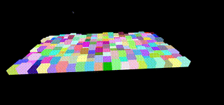

# Tile-Based VR Game Environment

This project provides a foundational framework for a tile-based virtual reality (VR) game environment, featuring camera panning and dynamic terrain loading. It's designed to offer developers a starting point for creating immersive VR experiences with an emphasis on performance and interactivity.

<p align="center">
  
</p>

## Features

- **Tile-Based Terrain**: Efficiently manages and renders terrain using a grid of tiles, allowing for expansive and detailed environments without compromising performance.
- **Dynamic Camera Panning**: Implements camera controls for smooth panning and navigation through the game environment, enhancing the VR experience.
- **Chunk Loading**: Utilizes a chunk-based loading system to dynamically load and unload terrain data, ensuring optimal resource use and smooth gameplay.
- **Customizable Settings**: Offers configurable settings for terrain generation, camera behavior, and other key parameters, providing flexibility to adapt to various game designs.

## Getting Started

To set up the project locally for development and testing, follow these steps:

1. Clone the repository:
```
git clone https://github.com/nhukc/tile-based-vr-terrain.git
```

2. Navigate to the project directory:
```
cd tile-based-vr-terrain
```

3. Install dependencies:
```
npm install -g http-server
```

4. Run the development server:
```
cd src
http-server .
```

5. Open your web browser and navigate to http://localhost:8080 to view the project.

## License

Distributed under the MIT License. See LICENSE for more information.
